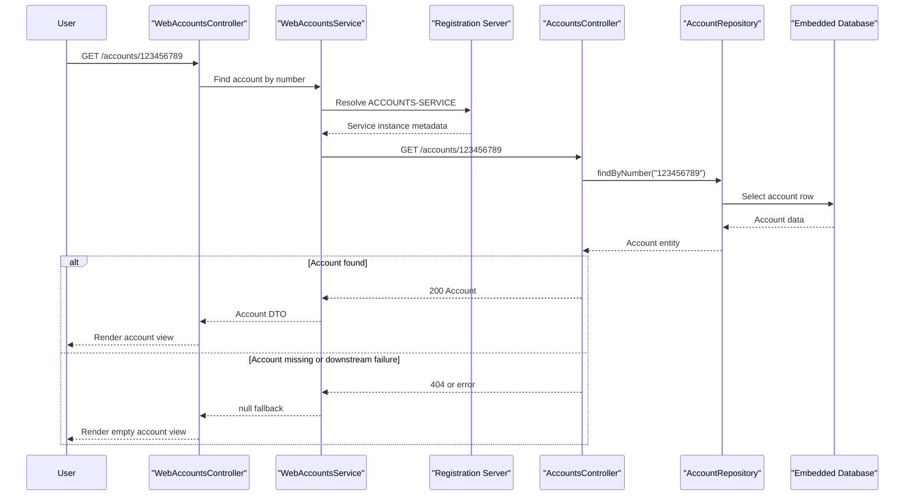

# API & Service Communication Contracts

This application exposes a small HTTP surface split between a REST-style accounts microservice and a server-rendered web front end. Communication is entirely synchronous and depends on Eureka-based service discovery plus a load-balanced `RestTemplate`.

## Service Catalog

| Service | Port | Category | Purpose |
|---|---:|---|---|
| registration-server | 1111 | Infrastructure | Hosts the Eureka registry used by the other runtime roles |
| accounts-service | 2222 | Business | Owns account data and exposes lookup endpoints by account number and owner |
| web-service | 3333 | API Layer | Serves Thymeleaf pages and forwards account searches to the accounts service |

## API Endpoints Inventory

| Service | Method | Path | Request Type | Response Type |
|---|---|---|---|---|
| accounts-service | GET | `/accounts/{accountNumber}` | Path parameter `accountNumber:String` | `Account` JSON or HTTP 404 |
| accounts-service | GET | `/accounts/owner/{name}` | Path parameter `name:String` | `List<Account>` JSON or HTTP 404 |
| web-service | GET | `/` | None | `index` view |
| web-service | GET | `/accounts` | None | `index` view |
| web-service | GET | `/accounts/{accountNumber}` | Path parameter `accountNumber:String` | `account` view populated from `Account` DTO or empty state |
| web-service | GET | `/accounts/owner/{text}` | Path parameter `text:String` | `accounts` view populated from `List<Account>` |
| web-service | GET | `/accounts/search` | None | `accountSearch` view with `SearchCriteria` |
| web-service | GET | `/accounts/dosearch` | Query-backed `SearchCriteria` model | Redirected account or owner search result view |

## Management & Observability Endpoints

| Service | Endpoint | Custom Metrics (if any) |
|---|---|---|
| accounts-service | `/actuator/health`, `/actuator/info`, `/actuator/metrics` and other default Spring Boot actuator endpoints | None detected |
| web-service | `/actuator/health`, `/actuator/info`, `/actuator/metrics` and other default Spring Boot actuator endpoints | None detected |
| registration-server | Eureka dashboard plus default Spring Boot management behavior if enabled by Boot defaults | None detected |

## DTOs & Contracts

The REST contract revolves around a single `io.pivotal.microservices.accounts.Account` entity returned by the accounts service and a separate `io.pivotal.microservices.services.web.Account` DTO used by the web tier for JSON deserialization and view rendering. `SearchCriteria` acts as a query/form model for the web search flow, validating either a 9-digit account number or free-text owner search input. No OpenAPI, Swagger, GraphQL, or protobuf contracts are present; serialization uses Spring Boot's default Jackson support.

## Communication Patterns

All service-to-service communication is synchronous HTTP. `WebAccountsService` sends `GET` requests to `http://ACCOUNTS-SERVICE/accounts/...`, relying on `@LoadBalanced RestTemplate` plus Eureka registration to resolve the logical service name at runtime. There is no asynchronous messaging, no API gateway product, no client retry policy, and no circuit breaker framework; the main fallback behavior is local exception handling in the web tier that returns `null` or an empty result when the downstream service is unavailable or responds with 404. Startup order matters for availability: the registration server must start first, then the accounts service can register, and finally the web service can discover the accounts service. No TLS, authentication, or authorization checks are configured, so all application and actuator endpoints are effectively public in this demo setup.

## Service Technology Matrix

| Service | Web | Data Access | Discovery | Gateway | Actuator | Cache | Metrics |
|---|---|---|---|---|---|---|---|
| registration-server | Spring Boot app | None | Eureka server | No | Not explicitly customized | No | No custom metrics |
| accounts-service | Spring MVC REST | Spring Data JPA | Eureka client | No | Yes | No | No custom metrics |
| web-service | Spring MVC + Thymeleaf | None | Eureka client | Thin aggregation client | Yes | No | No custom metrics |

## Service Communication Sequence

