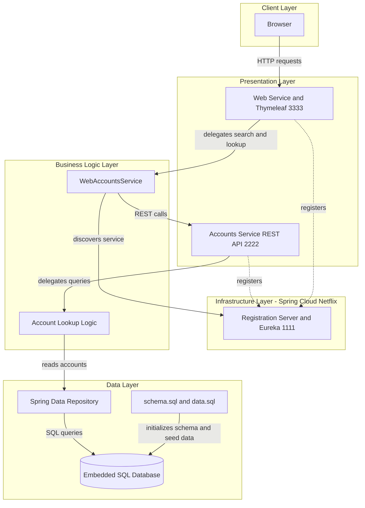
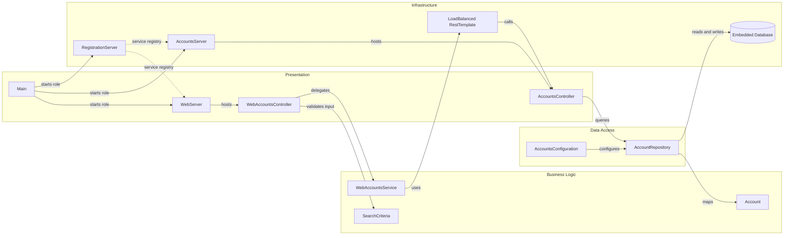

# Architecture Diagram

This repository packages a small Spring-based microservices demo into a single build artifact that can run in three roles. The deployed topology consists of a Eureka registration server, an accounts microservice, and a web application that discovers and calls the accounts service.

## Application Architecture

### Technology Stack Summary

| Layer | Technology | Version | Purpose |
|---|---|---:|---|
| Presentation | Spring Boot Web + Thymeleaf | 2.4.2 | Serves the web UI and HTTP endpoints |
| Service Discovery | Spring Cloud Netflix Eureka Server and Client | 2020.0.0 | Registers services and resolves logical service names |
| Business Logic | Spring Framework components | via Spring Boot 2.4.2 | Hosts controller and service-layer lookup logic |
| Data Access | Spring Data JPA | via Spring Boot 2.4.2 | Provides repository-based data access |
| Persistence | Embedded SQL database initialized from scripts | demo configuration | Stores account records for the accounts service |
| Runtime | OpenJDK JRE container image | 8 | Runs the packaged executable jar |

### Data Storage & External Services

The only persisted data is account information stored in an embedded in-memory SQL database that is created from `schema.sql` and seeded from `data.sql` at startup. The application has no third-party APIs, message brokers, or caches; its only external dependency at runtime is the Eureka registration server used for service discovery between the web and accounts services.

### Key Architectural Decisions

- A single executable jar is reused for all three runtime roles, with `Main` dispatching to the registration, accounts, or web server based on the first command-line argument.
- Inter-service communication uses logical service names and a `@LoadBalanced RestTemplate` instead of hard-coded host and port values.
- Only the accounts service owns persistent state; the web service acts as a thin presentation and aggregation client over HTTP.

## Component Relationships

### Component Inventory

| Component | Layer | Type | Responsibility |
|---|---|---|---|
| Main | Presentation | Bootstrap class | Selects which server role to run from the shared jar |
| RegistrationServer | Infrastructure | Eureka server | Hosts service registration and discovery on port 1111 |
| AccountsServer | Infrastructure | Spring Boot app | Boots the accounts microservice on port 2222 |
| WebServer | Presentation | Spring Boot app | Boots the web application on port 3333 |
| WebAccountsController | Presentation | MVC controller | Handles account search and detail pages |
| AccountsController | Presentation | REST controller | Exposes account lookup endpoints |
| WebAccountsService | Business Logic | Service client | Calls the accounts service through discovery-aware HTTP |
| SearchCriteria | Business Logic | Input model | Validates search input rules for the web flow |
| AccountRepository | Data Access | Spring Data repository | Queries account records by number, owner, and count |
| AccountsConfiguration | Data Access | Configuration class | Builds the embedded database and JPA wiring |
| Account | Business Logic | Domain entity | Represents persisted account information |
