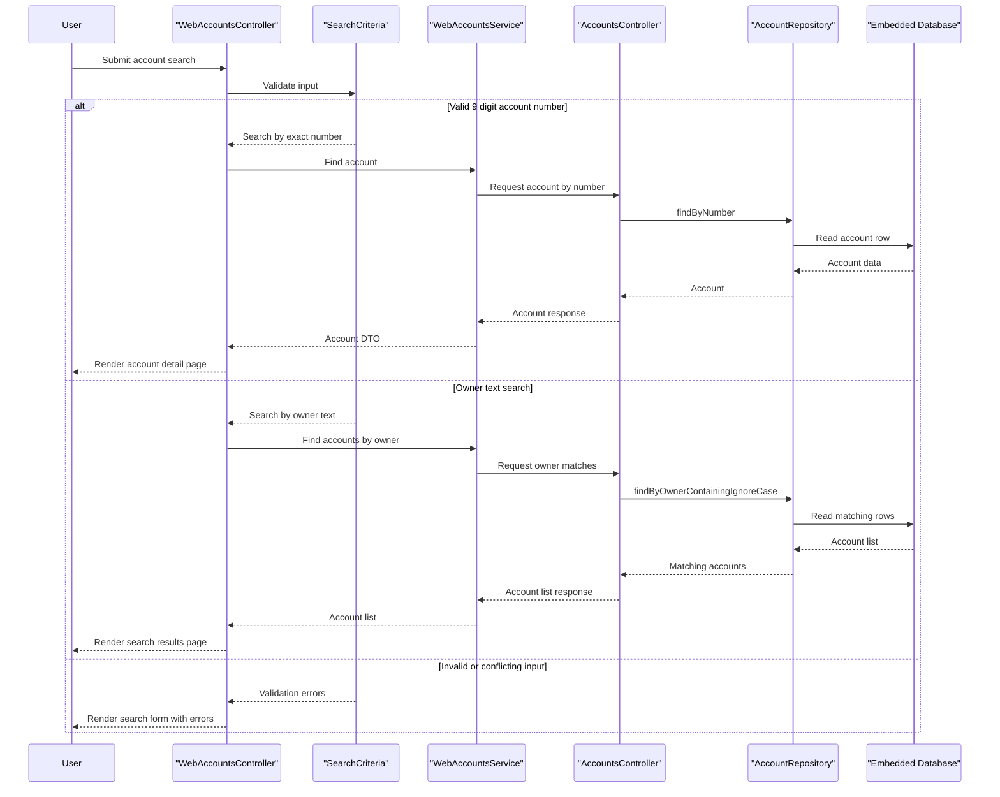

# Core Business Workflows

This demo application supports a simple account lookup domain: users search for accounts either by exact account number or by partial owner name. The main business interaction spans the web front end and the accounts service, with discovery handled transparently by the registration server.

## Domain Entities

| Entity | Service / Bounded Context | Description | Key Relationships |
|---|---|---|---|
| Account | accounts-service / Account Lookup | Core business record representing a customer account and current balance | Returned directly to the web service for display |
| SearchCriteria | web-service / Search Experience | User-entered search model for account lookup by number or owner text | Validates which lookup path the web flow should execute |
| Service Registration | registration-server / Discovery | Operational registry entry for application instances | Allows the web service to find the accounts service |

## Service-to-Domain Mapping

| Service | Domain Context | Owned Entities | External Dependencies |
|---|---|---|---|
| registration-server | Service Discovery | None | Receives registration traffic from the other roles |
| accounts-service | Account Lookup | Account | Embedded database, Eureka registry |
| web-service | Search and Presentation | SearchCriteria | Eureka registry, accounts-service HTTP API |

## Primary Workflows

### Workflow 1: View account by number

A user opens the web application and requests a specific account number. The web controller delegates to `WebAccountsService`, which discovers the accounts service and requests `GET /accounts/{accountNumber}`. The accounts service loads the matching account from the repository and returns it for rendering; if the account is missing, the web tier renders the account page without account details.

Business rules involved:
- Account number must be exactly 9 digits when submitted through the search form.
- The accounts service treats an unknown account number as a not-found condition.
- The web flow tolerates downstream failure by rendering an empty result instead of propagating a hard crash to the user.

### Workflow 2: Search accounts by owner text

A user submits a free-text owner search from the web form. `SearchCriteria` ensures the user did not also provide an account number, then the web service calls the accounts service owner-search endpoint. The accounts service performs a case-insensitive partial-name lookup and returns matching accounts for the results view.

Business rules involved:
- The user must provide either an account number or search text, but not both.
- Owner matching is partial and case-insensitive.
- No matches are treated as a not-found condition by the accounts service.

## Cross-Service Data Flows

The primary cross-service flow is a synchronous composition between `web-service` and `accounts-service`. The web tier provides the user-facing form and page rendering, while the accounts service remains the source of truth for account records. Data exchange is simple passthrough rather than deep aggregation: the web tier forwards lookup requests, receives `Account` or `List<Account>` payloads, and binds them to Thymeleaf views. When the downstream call fails or returns 404, the user experience degrades to an empty result page rather than a partially composed response from multiple services.

## Business Workflow Sequence

## Business Rules & Decision Logic

- `SearchCriteria` enforces that users provide either a 9-digit account number or owner search text, but never both at once.
- Account-number input must be numeric and exactly 9 characters long.
- Owner-name search uses a case-insensitive partial match, enabling broader lookup behavior than exact-name matching.
- `AccountsController` throws `AccountNotFoundException` when no account or owner match is found, establishing a not-found business outcome for the service contract.
- The web tier uses defensive error handling and empty-result rendering instead of retries, transactions, or compensating workflows.
- Account balances are generated during startup for demo purposes, so the workflow is read-oriented rather than transactional.
