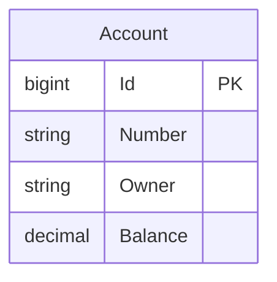

# Data Architecture & Persistence Layer

The data layer is intentionally small and centers on one account aggregate stored in an embedded relational database. Persistence is implemented with Spring Data JPA and initialized from SQL scripts every time the accounts service starts.

## Database Configuration

| Service/Module | DB Type | Profile | Driver | Connection | Migration Tool |
|---|---|---|---|---|---|
| accounts-service | Embedded in-memory SQL database | Default runtime for the accounts role | Embedded database provided by Spring JDBC with HSQLDB dependency present | Programmatic `EmbeddedDatabaseBuilder` using `schema.sql` and `data.sql` | SQL seed scripts only; no Flyway or Liquibase |
| web-service | None | Default runtime for the web role | None | No direct database connection | Not applicable |
| registration-server | None | Default runtime for the registration role | None | JDBC auto-configuration excluded | Not applicable |

## Data Ownership per Service

| Service | Tables Owned | ORM Framework | Caching | Notes |
|---|---|---|---|---|
| accounts-service | `T_ACCOUNT` | Spring Data JPA with Hibernate | None | Sole source of truth for account records |
| web-service | None | None | None | Reads account data only through REST calls to `accounts-service` |
| registration-server | None | None | None | Holds discovery metadata only, not business data |

## Entity Model

## Key Repository Methods

| Service | Repository | Notable Methods | Purpose |
|---|---|---|---|
| accounts-service | `AccountRepository` | `findByNumber(String)` | Fetches a single account by its 9-digit account number |
| accounts-service | `AccountRepository` | `findByOwnerContainingIgnoreCase(String)` | Supports case-insensitive owner-name search for the web flow |
| accounts-service | `AccountRepository` | `countAccounts()` | Reports the number of seeded accounts during controller startup logging |

## Caching Strategy

No caching layer is implemented. There are no cache annotations, cache manager beans, Redis dependencies, or second-level Hibernate cache configuration, so every lookup is served directly from the embedded relational store.

## Data Ownership Boundaries

Although the demo presents three runtime services, only the accounts service owns persistent business data. The web service does not access the database directly and instead uses REST calls to the accounts service for all reads, while the registration server is limited to service discovery concerns. This results in a simple service-owned data boundary with no shared database writes, CQRS split, or cross-service replication.

### Data Classification & Sensitivity

| Entity | Sensitive Fields | Classification (PII/PHI/PCI/None) | Controls in Place |
|---|---|---|---|
| Account | `owner`, `number`, `balance` | PII | No masking, encryption-at-rest, or field-level access controls are configured |

The seeded account data includes real-looking names and account identifiers, and balances are generated at startup in plaintext. No PHI or PCI-specific handling is present.
