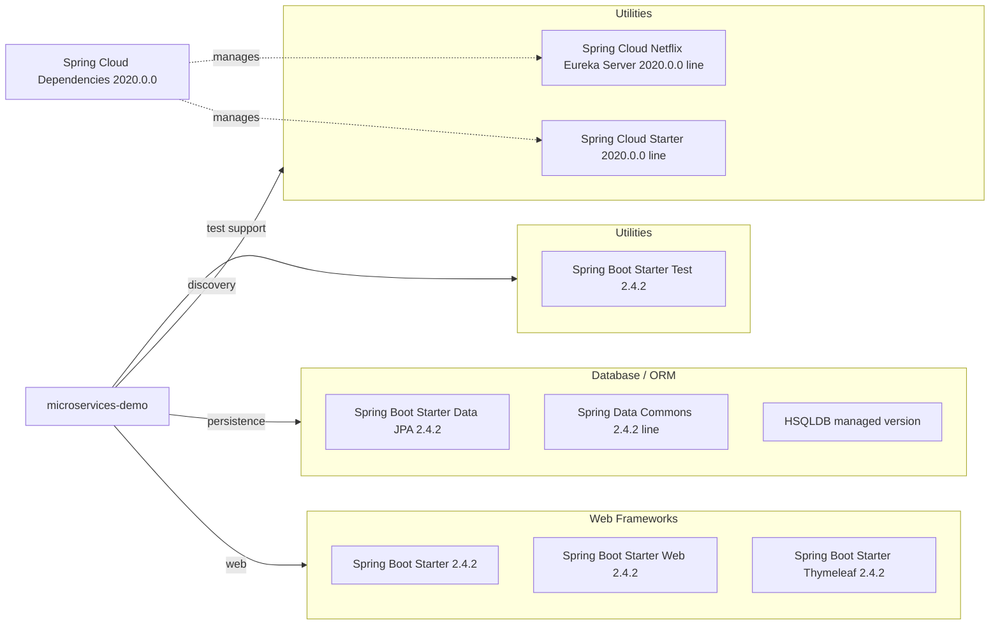

# Dependency Map

This project declares a compact dependency set centered on Spring Boot and Spring Cloud, with 9 primary dependencies in the maintained Maven build. Most functionality comes from starter dependencies, while the demo-specific runtime adds a single embedded database and Eureka-based discovery.

## Dependencies

### Dependency Summary

| Category | Count | Key Libraries | Notes |
|---|---:|---|---|
| Web Frameworks | 3 | Spring Boot Starter, Spring Boot Starter Web, Spring Boot Starter Thymeleaf | Provides the executable jar, embedded Tomcat, MVC, REST, and server-rendered UI |
| Database / ORM | 3 | Spring Boot Starter Data JPA, Spring Data Commons, HSQLDB | Enables repository-based persistence against the embedded demo database |
| Utilities | 3 | Spring Cloud Starter, Eureka Server, Spring Boot Starter Test | Discovery support is managed through the Spring Cloud BOM; the test starter is unusually declared without test scope in Maven |

### Version & Compatibility Risks

The project is pinned to Spring Boot 2.4.2, Spring Cloud 2020.0.0, and an OpenJDK 8 runtime image, all of which are dated for current modernization targets. The Gradle build also references an older Spring Boot 2.0.1.RELEASE plugin, so Maven is the more reliable dependency source and the one reflected in the assessment artifacts.

### Notable Observations

- The Maven build imports the Spring Cloud BOM, so Cloud dependency versions are managed centrally instead of on each dependency declaration.
- `spring-boot-starter-test` is declared in the Maven dependencies without a `<scope>test</scope>`, which means a test-focused starter appears on the main dependency graph.
- The Gradle build duplicates the Maven dependency set but is explicitly described in the README as not fully updated, creating a risk of drift between build tools.

## Test Dependencies

| Framework | Version | Notes |
|---|---|---|
| Spring Boot Starter Test | 2.4.2 | Declared in Maven without explicit test scope even though it is intended for testing |
| JUnit | 4.+ | Declared as `testCompile` in the Gradle build |

Total test-scope dependencies: 2

The repository does have test infrastructure, and the maintained Maven path runs successfully with `./mvnw test`. The main concern is dependency hygiene rather than missing test libraries, because the Maven POM keeps the Spring Boot test starter on the regular dependency list.
