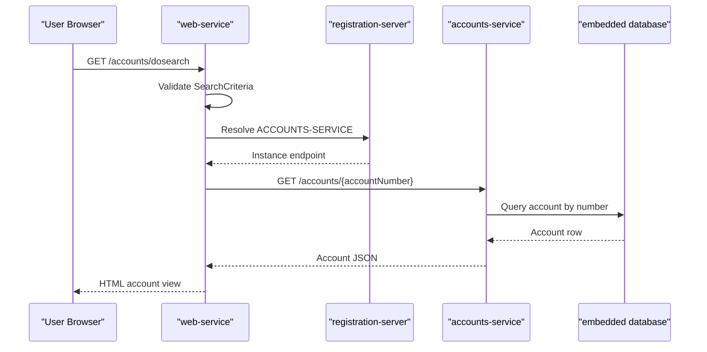

# API & Service Communication Contracts

The application exposes a small API surface for account lookup and a server-rendered web interface that consumes those endpoints. Communication is synchronous HTTP with discovery-based routing and no asynchronous messaging.

## Service Catalog

| Service | Port | Category | Purpose |
|---|---:|---|---|
| registration-server | 1111 | Infrastructure | Eureka registry for service registration and lookup |
| accounts-service | 2222 | Business | REST API for account retrieval by account number and owner name |
| web-service | 3333 | API Layer | MVC UI that queries accounts-service and renders pages |

## API Endpoints Inventory

| Service | Method | Path | Request Type | Response Type |
|---|---|---|---|---|
| accounts-service | GET | /accounts/{accountNumber} | Path param `String accountNumber` | `Account` or error (not found) |
| accounts-service | GET | /accounts/owner/{name} | Path param `String name` | `List<Account>` or error (not found) |
| web-service | GET | /accounts/{accountNumber} | Path param | HTML view (`account`) |
| web-service | GET | /accounts/owner/{text} | Path param | HTML view (`accounts`) |
| web-service | GET | /accounts/search | None | HTML search form view |
| web-service | GET | /accounts/dosearch | Query/form params via `SearchCriteria` | HTML search/detail/list view |
| web-service | GET | / | None | HTML index view |
| accounts-service | GET | / | None | HTML index view |

## Management & Observability Endpoints

| Service | Endpoint | Custom Metrics (if any) |
|---|---|---|
| accounts-service | /actuator/* (web exposure include all) | None detected |
| web-service | /actuator/* (web exposure include all) | None detected |
| registration-server | Eureka dashboard root | None detected |

## DTOs & Contracts

- `io.pivotal.microservices.accounts.Account` is both the service-level domain entity and JSON response contract returned by accounts-service.
- `io.pivotal.microservices.services.web.Account` mirrors the account payload on web-service side for deserialization and rendering.
- `io.pivotal.microservices.services.web.SearchCriteria` is a request model for query/form binding in web UI search flow.
- No OpenAPI/Swagger, protobuf, or GraphQL contract artifacts were found.
- Serialization relies on Spring Boot defaults (Jackson).

## Communication Patterns

- **Synchronous**: web-service uses `LoadBalanced RestTemplate` to call accounts-service by logical name `ACCOUNTS-SERVICE`.
- **Asynchronous**: none detected (no queue/broker client dependencies).
- **Service discovery**: Eureka client registration and lookup against registration-server.
- **Resilience**: no explicit circuit breaker/retry library configured; web-service handles some HTTP errors (e.g., not-found) and returns null-driven fallback UI states.
- **Startup dependency chain**: registration-server should start first for reliable discovery; accounts-service and web-service can then register and resolve each other.
- **Security posture**: no API authentication, authorization, or TLS configuration is defined in service configs; actuator is fully exposed in current profile.

## Service Technology Matrix

| Service | Web | Data Access | Discovery | Gateway | Actuator | Cache | Metrics |
|---|---|---|---|---|---|---|---|
| registration-server | Eureka server UI | None | Server | No | Not explicit | No | Basic actuator through Boot defaults |
| accounts-service | Spring MVC REST | Spring Data JPA + embedded DB | Client | No | Yes | No | Basic actuator |
| web-service | Spring MVC + Thymeleaf | None | Client | No | Yes | No | Basic actuator |

## Service Communication Sequence

