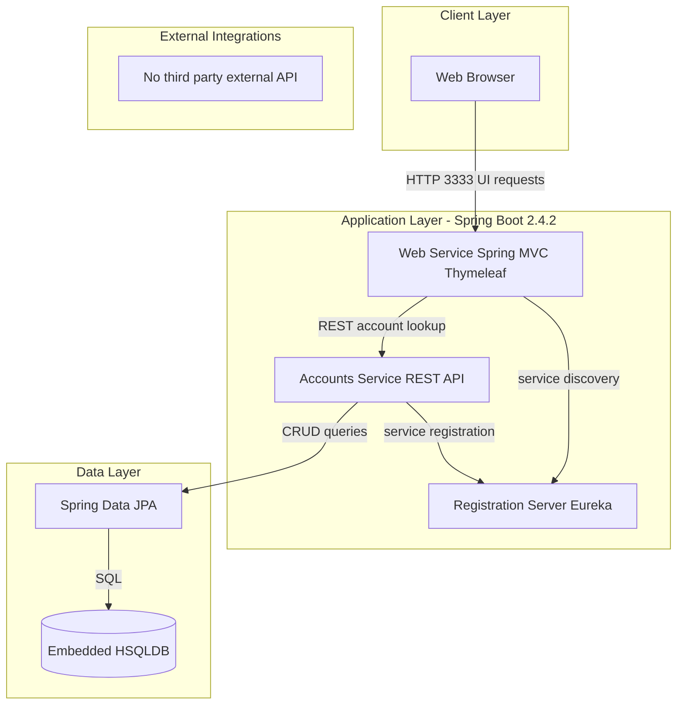
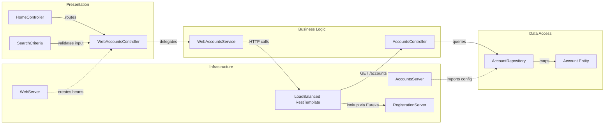

# Architecture Diagram

This repository packages three Spring Boot processes in one deployable artifact: Eureka registration server, accounts API service, and a web UI service. The system is service-discovery driven and centered on account lookup use cases.

## Application Architecture



### Technology Stack Summary

| Layer | Technology | Version | Purpose |
|---|---|---|---|
| Presentation | Spring MVC + Thymeleaf | Boot 2.4.2 managed | Server-rendered web UI |
| Service Discovery | Netflix Eureka Server/Client | Spring Cloud 2020.0.0 managed | Service registration and lookup |
| Business/API | Spring Boot Web REST | Boot 2.4.2 managed | Account retrieval endpoints |
| Data Access | Spring Data JPA | Boot 2.4.2 managed | Repository abstraction |
| Data Store | HSQLDB embedded | managed | In-memory account storage |

### Data Storage & External Services

The accounts service persists data in an embedded relational database initialized from SQL scripts and accessed via Spring Data JPA. The web service calls the accounts service through a load-balanced RestTemplate resolved through Eureka; no outbound third-party API dependency is defined.

### Key Architectural Decisions

- Single Maven artifact hosts multiple Spring Boot entry points selected at startup (`registration`, `accounts`, `web`).
- Service-to-service communication uses logical service names and Eureka rather than hardcoded host addresses.
- Accounts persistence is intentionally local and in-memory for demo and fast-start behavior.

## Component Relationships



### Component Inventory

| Component | Layer | Type | Responsibility |
|---|---|---|---|
| WebAccountsController | Presentation | MVC Controller | Handles web account search and detail pages |
| SearchCriteria | Presentation | Form model/validator | Enforces search input rules |
| WebAccountsService | Business Logic | Service | Calls accounts microservice through load-balanced REST |
| AccountsController | Business Logic | REST Controller | Exposes account lookup endpoints |
| AccountRepository | Data Access | Spring Data Repository | Fetches accounts by number/owner and count |
| Account | Data Access | JPA Entity | Represents persisted account record |
| WebServer | Infrastructure | Boot application | Configures web-side beans and discovery client |
| AccountsServer | Infrastructure | Boot application | Runs accounts API and JPA configuration |
| RegistrationServer | Infrastructure | Eureka server | Hosts service registry |
```
