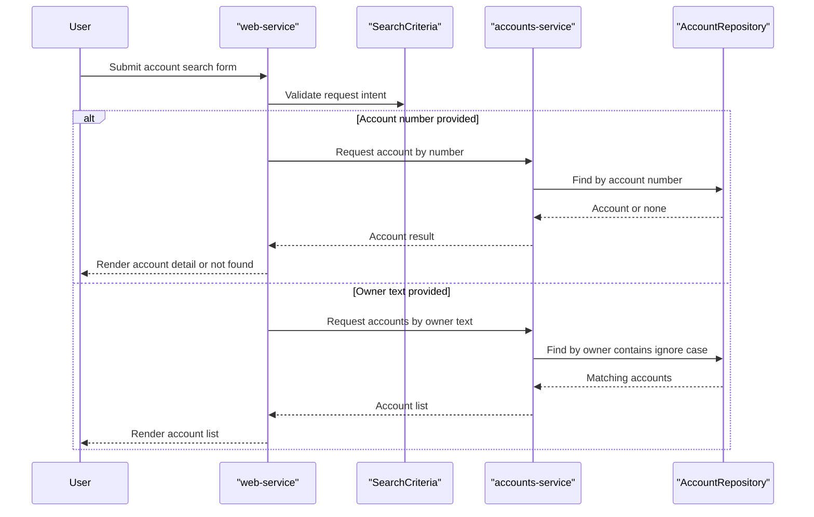

# Core Business Workflows

The application supports account lookup workflows for end users through a web UI backed by a dedicated accounts microservice. Business behavior is centered on validating search intent and returning account details or filtered account lists.

## Domain Entities

| Entity | Service / Bounded Context | Description | Key Relationships |
|---|---|---|---|
| Account | Accounts Management (accounts-service) | Customer account record with owner identity and balance | Queried by account number and owner-name search |
| SearchCriteria | Web Interaction (web-service) | User-provided search intent (number or text) with validation rules | Drives branch to exact lookup or owner-name lookup |

## Service-to-Domain Mapping

| Service | Domain Context | Owned Entities | External Dependencies |
|---|---|---|---|
| accounts-service | Accounts Management | Account | None for business data |
| web-service | Account Search Experience | SearchCriteria (request model) | accounts-service via REST and Eureka |
| registration-server | Service Registry | None | Eureka clients |

## Primary Workflows

### Workflow 1: Search account by account number

1. User submits account number through `/accounts/dosearch`.
2. `SearchCriteria.validate` enforces 9-digit numeric format and mutual exclusivity with free-text search.
3. web-service calls accounts-service `/accounts/{accountNumber}`.
4. accounts-service queries repository and returns account or not-found.
5. web-service renders account detail page (or missing-account page).

### Workflow 2: Search accounts by owner text

1. User submits owner text search through `/accounts/dosearch` or `/accounts/owner/{text}`.
2. Validation ensures owner text is provided when account number is absent.
3. web-service calls accounts-service `/accounts/owner/{name}`.
4. accounts-service performs case-insensitive contains search and returns matching list.
5. web-service renders account list page.

## Cross-Service Data Flows

The only cross-service business flow is **web-service → accounts-service** for account retrieval. Data composition is minimal: web-service forwards search parameters, receives account payload(s), and maps them into HTML views. If downstream lookups return no data, the workflow degrades to empty/not-found user responses rather than retrying or composing alternate data sources.

## Business Workflow Sequence

## Business Rules & Decision Logic

- Search requests must provide **exactly one** of: account number or search text.
- Account number must be numeric and exactly 9 digits.
- Owner search is case-insensitive and supports partial matches.
- If no account(s) are found, accounts-service raises not-found behavior and web-service maps this to user-facing empty/not-found views.
- Business transaction scope is read-only lookup; no state mutation workflow is present.
