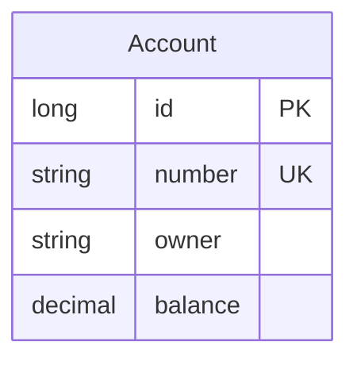

# Data Architecture & Persistence Layer

The data layer is centered on a single relational account model backed by an embedded database and accessed through Spring Data JPA. Persistence is owned by the accounts service; web and registration services are stateless regarding domain data.

## Database Configuration

| Service/Module | DB Type | Profile | Driver | Connection | Migration Tool |
|---|---|---|---|---|---|
| accounts-service | Embedded HSQLDB (in-memory) | default | Embedded DB builder managed | Programmatic DataSource with schema/data SQL scripts | None (schema.sql + data.sql bootstrap scripts) |
| web-service | None | default | N/A | JDBC auto-config excluded | N/A |
| registration-server | None | default | N/A | JDBC auto-config excluded | N/A |

## Data Ownership per Service

| Service | Tables Owned | ORM Framework | Caching | Notes |
|---|---|---|---|---|
| accounts-service | T_ACCOUNT | Spring Data JPA (Hibernate) | None | Single bounded context for account records |
| web-service | None | None | None | Reads account data through REST API |
| registration-server | None | None | None | Service registry only |

## Entity Model

## Key Repository Methods

| Service | Repository | Notable Methods | Purpose |
|---|---|---|---|
| accounts-service | AccountRepository (`src/main/java/io/pivotal/microservices/accounts/AccountRepository.java`) | `findByNumber(String)`, `findByOwnerContainingIgnoreCase(String)`, `countAccounts()` | Primary account lookup and search operations for REST endpoints |

## Caching Strategy

No explicit caching provider, cache regions, or cache annotations were detected. The persistence path is direct controller/service to JPA repository to embedded relational storage.

## Data Ownership Boundaries

This system follows **single-service data ownership**: only accounts-service owns and mutates persisted domain data. Cross-service reads occur via HTTP calls from web-service to accounts-service, with no direct shared database access by web-service or registration-server.

### Data Classification & Sensitivity

| Entity | Sensitive Fields | Classification (PII/PHI/PCI/None) | Controls in Place |
|---|---|---|---|
| Account | owner (person name), number (account identifier) | PII | No explicit encryption-at-rest or masking controls declared in code/config |
