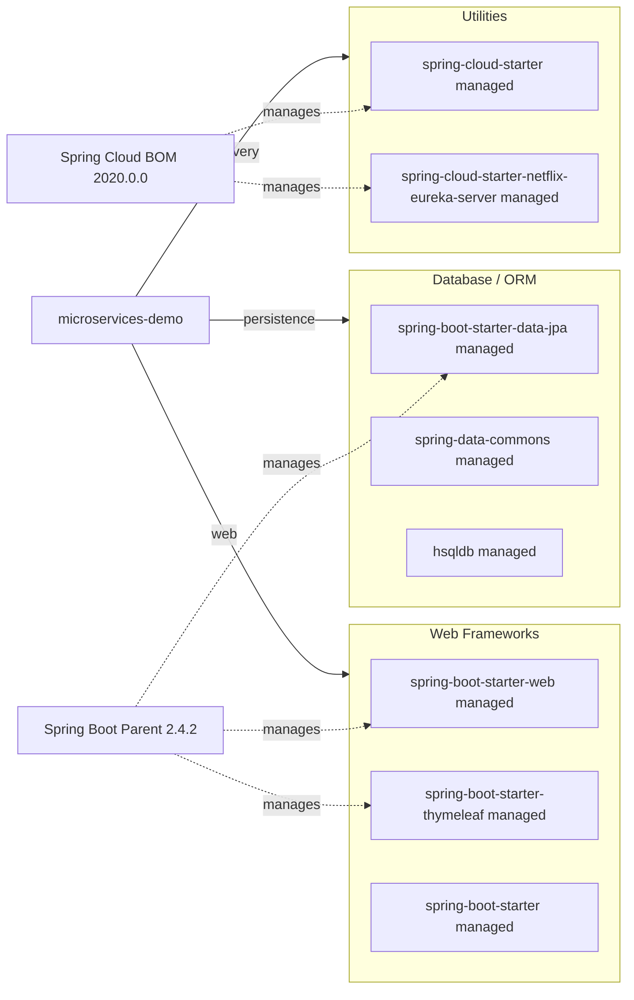

# Dependency Map

This project declares a compact dependency set around Spring Boot, Spring Cloud, and JPA, with most versions managed by BOMs. Excluding test scope, there are 7 primary declared dependencies.

## Dependencies

### Dependency Summary

| Category | Count | Key Libraries | Notes |
|---|---:|---|---|
| Web Frameworks | 3 | spring-boot-starter-web, spring-boot-starter-thymeleaf | MVC and server-side templates |
| Database / ORM | 3 | spring-boot-starter-data-jpa, hsqldb | JPA with embedded DB |
| Utilities | 2 | spring-cloud-starter, eureka-server starter | Discovery and cloud bootstrap |

### Version & Compatibility Risks

The stack is pinned to Spring Boot 2.4.2 / Spring Cloud 2020.0.0, which is an older generation and may require coordinated upgrades for modern Java runtimes and current Spring Cloud components.

### Notable Observations

- Version management is centralized through Spring Boot parent and Spring Cloud BOM, reducing explicit per-artifact pinning.
- `spring-cloud-starter-netflix-eureka-server` is declared globally even though only the registration process needs server functionality.
- Embedded HSQLDB is suitable for demos but not production-grade persistence.

## Test Dependencies

| Framework | Version | Notes |
|---|---|---|
| spring-boot-starter-test | managed by Spring Boot 2.4.2 | Includes JUnit/assertion tooling bundle |

Total test-scope dependencies: 1

Test infrastructure is minimal and centered on Spring Boot test starter; no specialized integration/container test libraries are declared.
